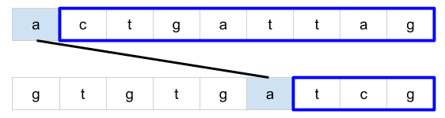
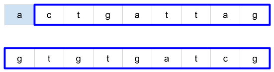
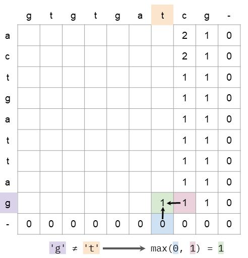

## Leetcode 1143. Longest Common Subsequence
>Given two strings text1 and text2, return the length of their longest common subsequence.
>
>A subsequence of a string is a new string generated from the original string with some characters(can be none) deleted without changing the relative order of the remaining characters. (eg, "ace" is a subsequence of "abcde" while "aec" is not). A common subsequence of two strings is a subsequence that is common to both strings.
>
>If there is no common subsequence, return 0.
>
>Example 1:
>
>Input: text1 = "abcde", text2 = "ace" 
>Output: 3  
>Explanation: The longest common subsequence is "ace" and its length is 3.
>
>Example 2:
>
>Input: text1 = "abc", text2 = "abc"
>Output: 3
>Explanation: The longest common subsequence is "abc" and its length is 3.
>
>Example 3:
>
>Input: text1 = "abc", text2 = "def"
>Output: 0
>Explanation: There is no such common subsequence, so the result is 0.
> 
>
>Constraints:
>
>1 <= text1.length <= 1000
>1 <= text2.length <= 1000
>
>The input strings consist of lowercase English characters only.

### Recursion with Memoization
- str1 中第i个letter可以在或者不在最终的结果中
- bottom-up 递归的方式对于idx1,idx2 memo[idx1][idx2] 为str1中第i个letter在或者不再最终结果得到的两个结果中的最大值


```java
class Solution {
    int[][] memo;
    String str1;
    String str2;
    // time complexity O(M * N * N) || space complexity O(M * N)
    // the time complexity of indexOf() is O(N)
    public int longestCommonSubsequence(String text1, String text2) {
        if(text1.length() == 0 || text2.length() == 0)
            return 0;
        memo = new int[text1.length()][text2.length()];
        for(int[] arr : memo)
            Arrays.fill(arr, -1);
        str1 = text1;
        str2 = text2;
        
        return LCS(0, 0);
    }
    
    private int LCS(int idx1, int idx2){
        if(idx1 >= str1.length() || idx2 >= str2.length())
            return 0;
        
        if(memo[idx1][idx2] != -1)
            return memo[idx1][idx2];
        
        int letterExcluded = LCS(idx1 + 1, idx2);
        
        int letterIncluded = 0;
        int pos = str2.indexOf(str1.charAt(idx1), idx2);
        if(pos != -1)
            letterIncluded = LCS(idx1 + 1, pos + 1) + 1;
            
        memo[idx1][idx2] = Math.max(letterExcluded, letterIncluded);
        
        return memo[idx1][idx2];
    }
}
```

### Optimized time complexity
- recursion是bottom-up, 递归到底是从两个string最后一个char开始向前移动
- str1 的idx1 位置上的letter可能在也可能不在, str2 的idx2位置上的letter可能在也可能不再
- 如果str1.charAt(idx1) == str2.charAt(idx2) 没有理由不将当前字符串计入到最终结果中
```java
class Solution {
    int[][] memo;
    String str1;
    String str2;
    
    public int longestCommonSubsequence(String text1, String text2) {
        if(text1.length() == 0 || text2.length() == 0)
            return 0;
        memo = new int[text1.length()][text2.length()];
        for(int[] arr : memo)
            Arrays.fill(arr, -1);
        str1 = text1;
        str2 = text2;
        
        return LCS(0, 0);
    }
    
    private int LCS(int idx1, int idx2){
        if(idx1 >= str1.length() || idx2 >= str2.length())
            return 0;
        
        if(memo[idx1][idx2] != -1)
            return memo[idx1][idx2];
        
        int res = 0;
        if(str1.charAt(idx1) == str2.charAt(idx2))
            res = 1 + LCS(idx1 + 1, idx2 + 1);
        else
            res = Math.max(LCS(idx1 + 1, idx2), LCS(idx1, idx2 + 1));
            
        memo[idx1][idx2] = res;
        
        return memo[idx1][idx2];
    }
}
```

### DP

```java
class Solution {
    //   ' a d c e
    // ' 0 0 0 0 0
    // a 0 1 1 1 1
    // c 0 1 1 2 1
    // time complexity O(M * N) || space O(M * N)
    public int longestCommonSubsequence(String text1, String text2) {
        int N1 = text1.length();
        int N2 = text2.length();
        if(N1 == 0 || N2 == 0)
            return 0;
        
        int[][] memo = new int[N1 + 1][N2 + 1];
        for(int i = 1; i <= N1; i++)
            for(int j = 1; j <= N2; j++){
               if(text1.charAt(i - 1) == text2.charAt(j - 1))
                   memo[i][j] = memo[i - 1][j - 1] + 1;
                else
                    memo[i][j] = Math.max(memo[i - 1][j], memo[i][j - 1]);
            }
                
        return memo[N1][N2];
    }
}
```