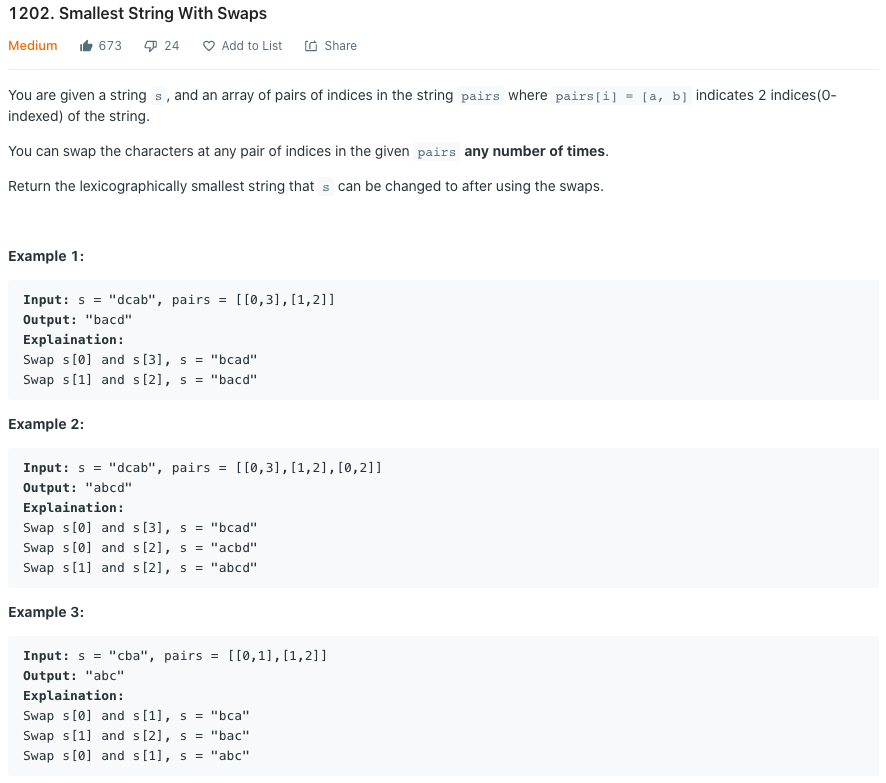
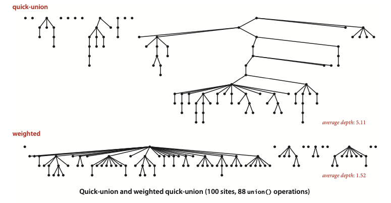

## Leetcode 1202 Smallest String With Swaps


### Solution 
- 解题关键在于将字符串连接起来，相连接的字符串lexicographically排序
- 使用Union Find + PriorityQueueue
    - Union Find 连接字符串，创建一个Map<Integer, PriorityQueue<Character>>用来存储union Find中同一个root下的所有字符串
    - Priority底层为Heap，入队会自动排序

- Union Find几个关键API
    - int find(int q) 找q的root
    - boolean connected(int p, int q) p, q是否相连接
    - void union(int p, int q) p, q如果已经相连，不进行任何操作，如果未连接则连接p和q
    - int count() 返回当前components(equivalence classes)的个数

- Union Find的field中有两个数组，id[]和sz[], 分别用来存储第ith结点的root结点以及以当前结点为root的树中成员的个数
- 利用sz[]信息，将sz值小的root 连接到sz值较大的root上能有效降低树的高度，这样find(), connected(), union() time complexity均为O(logN)


```java
class Solution {
    class UF{
        int[] id;
        int[] sz;
        
        public UF(int N){
            id = new int[N];
            sz = new int[N];
            for(int i = 0; i < N; i++){
                id[i] = i;
                sz[i] = 1;
            }
        }
        public int find(int p){
            while(id[p] != p) p = id[p];
            
            return p;
        }
        
        public boolean connected(int p, int q){
            return find(p) == find(q);
        }
        
        public void union(int p, int q){
            int i = find(p);
            int j = find(q);
            if(i == j) 
                return;
            
            if(sz[i] > sz[j]){
                id[j] = i;
                sz[i] += sz[j];
            }else{
                id[i] = j;
                sz[j] += sz[i];
            }
        }
    }
    //time complexity O(NlogN) || space complexity O(N)
    public String smallestStringWithSwaps(String s, List<List<Integer>> pairs) {
        int N = s.length();
        //key is the root, value contains ordered characters  
        Map<Integer, PriorityQueue<Character>> graphs = new HashMap<>();
        
        //Union find
        UF uf = new UF(N);
        for(int i = 0; i < pairs.size(); i++){
            uf.union(pairs.get(i).get(0), pairs.get(i).get(1));
        }
        
        for(int i = 0; i < N; i++){
            int component = uf.find(i);
            graphs.computeIfAbsent(component, (list) -> new PriorityQueue<>());
            //characters in the same component would be automatically ordered by the Heap
            graphs.get(component).add(s.charAt(i));
        }
        
        StringBuilder builder = new StringBuilder();
        //time complexity O(NlogN)
        for(int i = 0; i < N; i++){
            int component = uf.find(i);
            builder.append(graphs.get(component).poll());
        }
        
        return builder.toString();
    }
}
```
