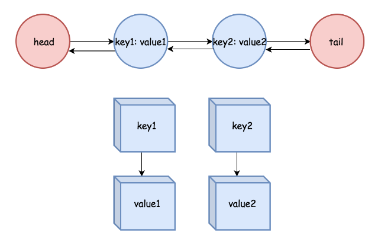

## LRU(Least Recent Used)

- LRU是操作系统的一种cache algorithm
- 实际生产中也可能被应用到。想象一下公司业务要求对于频繁查询的信息(从DB中取值)存储在Hash Table中作为缓存，这样可以获得O(1)的性能。但是这个Hash Table随着时间的推移，肯定会无限膨胀，单点服务器很快就会挂掉，而你的公司过于穷，没钱买多余的服务器，这时候就可以使用LRU。
- LRU的实现原理是使用Double LinkedList + HashTable。所有要查询的信息以Key Value形式存储在HashTable中，然后将Key值使用双向链表连接起来。
    - 如果使用get(K key)查询了一个值，获取结果的同时将其挪动到LinkedList的队尾
    - 如果put(K key, V value)是对已有的键值对进行更新的话那么更新value后同样将Key挪动到LinkedList队尾
    - 如果当前容量capacity已经满了，那么LinkedList首部元素即为LRU元素，将其移除再添加新值
    - 这里实现双向链表有一个trick是生成一个head 和 tail的dummyNode，这样remove Node的时候就不用考虑越界的问题了


### Solution
- 以上描述基本说明了解决的思路，Java自带的LinkedList由于remove一个特定元素需要遍历整个链表，只能获得O(N)的性能，所以需要自己创建一个内部类来实现双向链表
- 然而Java 中的LinkedHashMap已经实现了LRU的算法，一个trick是直接extends LinkedHashMap，override removeEldestEntry()方法。当然如果面试的时候这么做的话，估计面试官得当场把你赶出去

```java
class LRUCache {
    class DLinkedNode{
        int key;
        int value;
        DLinkedNode prev;
        DLinkedNode next;
        public DLinkedNode(){}
        public DLinkedNode(int key, int value){
            this.key = key;
            this.value = value;
        }
    }

    private void removeNode(DLinkedNode node){
        DLinkedNode prevNode = node.prev;
        DLinkedNode nextNode = node.next;
        prevNode.next = nextNode;
        nextNode.prev = prevNode;

    }

    private void addToTail(DLinkedNode node){
        DLinkedNode prevNode = tail.prev;
        prevNode.next = node;
        node.prev = prevNode;
        node.next = tail;
        tail.prev = node;
    }
    /**dummy head and dummy tail */
    private DLinkedNode head;
    private DLinkedNode tail;
    private int capacity;
    private HashMap<Integer, DLinkedNode> map;

    public LRUCache(int capacity) {
        this.capacity = capacity;
        map = new HashMap<>();
        head = new DLinkedNode();
        tail = new DLinkedNode();
        head.next = tail;
        tail.prev = head;
    }
    
    public int get(int key) {
        if(!map.containsKey(key))
            return -1;
        DLinkedNode node = map.get(key);
        removeNode(node);
        addToTail(node);

        return node.value;
    }
    
    public void put(int key, int value) {
        if(map.containsKey(key)){
            DLinkedNode node = map.get(key);
            node.value = value;
            removeNode(node);
            addToTail(node);
            map.put(key, node);

            return;
        }

        if(capacity == map.size()) {
            DLinkedNode node = head.next;
            removeNode(node);
            map.remove(node.key);
        }

        DLinkedNode node = new DLinkedNode(key, value);
        addToTail(node);
        map.put(key, node);
    }
}

/**
 * Your LRUCache object will be instantiated and called as such:
 * LRUCache obj = new LRUCache(capacity);
 * int param_1 = obj.get(key);
 * obj.put(key,value);
 */
```

```java
/*LRU Java Trick*/
class LRUCache extends LinkedHashMap<Integer, Integer>{
    private int capacity;
    
    public LRUCache(int capacity) {
        super(capacity, 0.75F, true);
        this.capacity = capacity;
    }

    public int get(int key) {
        return super.getOrDefault(key, -1);
    }

    public void put(int key, int value) {
        super.put(key, value);
    }

    @Override
    protected boolean removeEldestEntry(Map.Entry<Integer, Integer> eldest) {
        return size() > capacity; 
    }
}

/**
 * Your LRUCache object will be instantiated and called as such:
 * LRUCache obj = new LRUCache(capacity);
 * int param_1 = obj.get(key);
 * obj.put(key,value);
 */
```