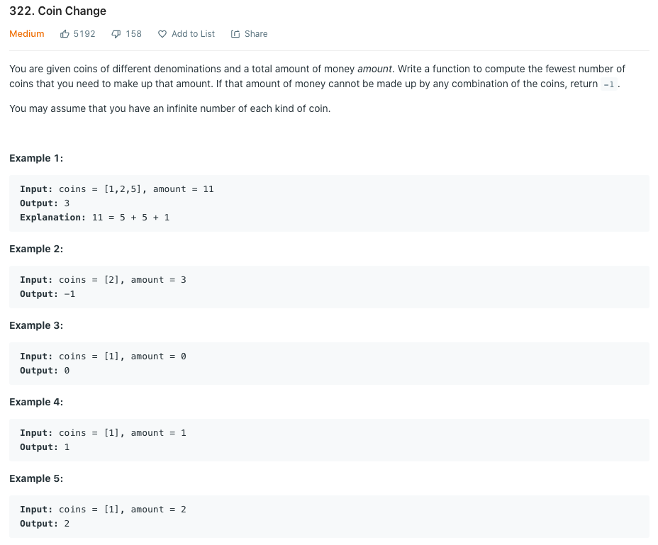

## Leetcode 322 Coin Change


### Solution
- 这是一个典型的可重复取值的KnapSack问题
- Edge cases：
    - amount == 0
    - coins[]中的最小面额都比amount大
    - coins[]无法凑成需要的amount
- 对于无法凑得的amount，用-1代表
- 判断条件的优化: 如果memo[j - denom] = -1,无论当前memo[j]为和情况(-1或者其他值)都不需要更新

```java
class Solution {
    public int coinChange(int[] coins, int amount) {
        if(coins == null)
            return -1;
        int[] memo = new int[amount + 1];
        Arrays.fill(memo, -1);
        memo[0] = 0;
        
        for(int i = 0; i < coins.length; i++){
            int denom = coins[i];
            for(int j = denom; j <= amount; j++){
                // if(memo[j] == -1 && memo[j - denom] == -1)
                //     memo[j] = -1;
                // else if(memo[j] == -1)
                //     memo[j] = memo[j - denom] + 1;
                // else if(memo[j - denom] == -1)
                //     ;
                // else
                //     memo[j] = memo[j] < (memo[j - denom] + 1) ? memo[j] : (memo[j - denom] + 1);
                if(memo[j - denom] != -1){
                    if(memo[j] == -1)
                        memo[j] = memo[j - denom] + 1;
                    else
                        memo[j] = memo[j] < (memo[j - denom] + 1) ? memo[j] : (memo[j - denom] + 1);
                }
            }
        }
        return memo[amount];
    }
}
```

```java
class Solution {
  public int coinChange(int[] coins, int amount) {
    // memo[i] represents the minimum number of coins we need to make up amount i
    int[] memo = new int[amount + 1];
    int len = coins.length;
    Arrays.fill(memo, -1);
    memo[0] = 0;
    for(int i = 1; i <= amount; i++){
      for(int j = 0; j < len; j++){
        int money = i - coins[j];
        if(money >= 0 && memo[money] != -1){
          if(memo[money] + 1 < memo[i] || memo[i] == -1)
            memo[i] = 1 + memo[money];
        }
      }
    }

    return memo[amount];
  }
}
```
