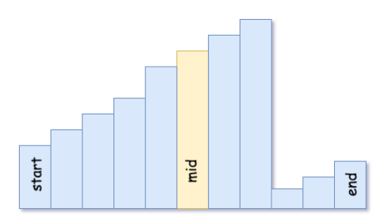
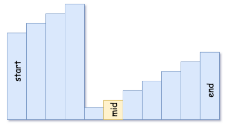

## 33.Search in Rotated Sorted Array
You are given an integer array nums sorted in ascending order, and an integer target.

Suppose that nums is rotated at some pivot unknown to you beforehand (i.e., [0,1,2,4,5,6,7] might become [4,5,6,7,0,1,2]).

If target is found in the array return its index, otherwise, return -1.

 

Example 1:

Input: nums = [4,5,6,7,0,1,2], target = 0
Output: 4
Example 2:

Input: nums = [4,5,6,7,0,1,2], target = 3
Output: -1
Example 3:

Input: nums = [1], target = 0
Output: -1
 

Constraints:

1 <= nums.length <= 5000
-10^4 <= nums[i] <= 10^4
All values of nums are unique.
nums is guranteed to be rotated at some pivot.
-10^4 <= target <= 10^4

## Solution
- nums is guranteed to be rotated at some pivot
- 使用binary search, 数组一定旋转过，且后半区域值小于前半区域
  - 当target > nums[0]的时候要寻找的值在前半区
    - nums[mid] < target 可能落在了前半区也可能落在了后半区，因为后半区的值都小于nums[0],nums[0] < target;需要用nus[mid]与nums[0]作比较来确定区域进而调整left right位置
    - nums[mid] > target, 毫无疑问right = mid - 1；
  - 当target < nums[0]的时候要寻找的值在后半区
    - nums[mid] > target 可能落在来前半区也可能落在来后半区，这时候需要比较nums[mid] 与 nums[0]作比较来确定区间
    - nums[mid] < target, 毫无疑问 left = mid + 1; 

```java
  class Solution {
    //time O(logN) || space O(1)
    public int search(int[] nums, int target) {
        if(nums[0] == target)
            return 0;

        int left = 0;
        int right = nums.length - 1;
        while(left <= right){
            int mid = left + (right - left) / 2;
            if(nums[mid] == target)
                return mid;
            if(nums[0] < target){
                if(nums[mid] < target && nums[mid] >= nums[0])
                    left = mid + 1;
                else
                    right = mid - 1;
            }else if(nums[0] > target){
                if(nums[mid] > target && nums[mid] < nums[0])
                    right = mid - 1;
                else
                    left = mid + 1;
            }
        }
    
        return -1;
    }
  } 
```

## Solution 2
- 以上解法思路过于繁琐，可以参考以下方式思考：
  - mid所处的位置只能为以下两种情况
    - 
    - 
  - 对于这两种情况我们都用nums[mid]的值与nums[start]或者nums[end]其中的一个配合来判断target所处的区间，进而判断left挪动还是right挪动
  - 代码的整体框架还是Binary Search的方法

```java
  class Solution {
    //time O(logN) || space O(1)
    public int search(int[] nums, int target) {
        int left = 0;
        int right = nums.length - 1;

        while(left <= right){
            int mid = left + (right - left) / 2;
            if(nums[mid] == target)
                return mid;
            else if(nums[mid] >= nums[left]){
                if(target < nums[mid] && target >= nums[left])
                    right = mid - 1;
                else
                    left = mid + 1;
            }else{
                if(target > nums[mid] && target <= nums[right])
                    left = mid + 1;
                else
                    right = mid - 1;
            }
        }

        return -1;
    }
  }
```