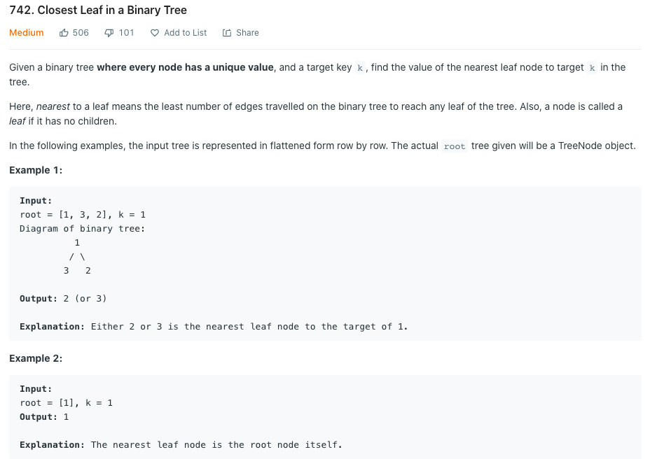
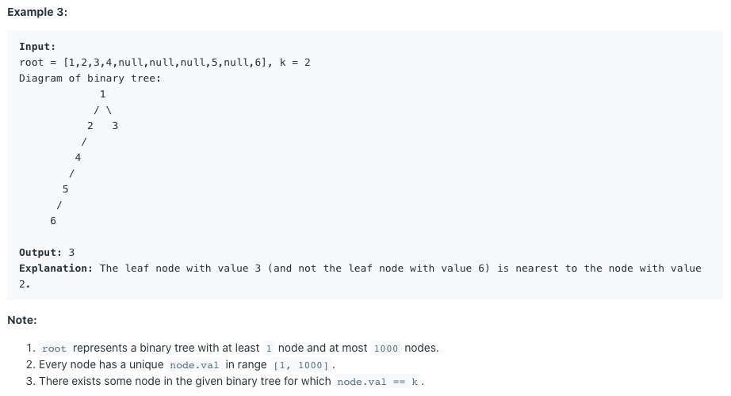

## Leetcode 742. Closest Leaf in a Binary Tree



### solution
- 第一种方法考虑使用gragh和dfs,对每一个结点建立一个[currentNode, ParentNode, LeftNode, RightNode]的adjecent matrix
- 找到val=k的node，使用bfs的方法遍历与之相连的结点，找到第一个left==null && right==null的结点即为我们想要的结果
```java
/**
 * Definition for a binary tree node.
 * public class TreeNode {
 *     int val;
 *     TreeNode left;
 *     TreeNode right;
 *     TreeNode() {}
 *     TreeNode(int val) { this.val = val; }
 *     TreeNode(int val, TreeNode left, TreeNode right) {
 *         this.val = val;
 *         this.left = left;
 *         this.right = right;
 *     }
 * }
 */
class Solution {
    //create a graph, foe each node it has a list contains its adjacent nodes(每一个结点只记录与之相邻的结点，最多就3个，parent，left,right)
    //since the value of node is unique, we take the value as the key
    private Map<Integer, List<TreeNode>> graph = new HashMap<>();

    public int findClosestLeaf(TreeNode root, int k) {
        if(root == null)
            return -1;
        //dfs create graph
        dfs(root, null);
        //bfs find the nearest leaf node
        LinkedList<TreeNode> queue = new LinkedList<>();
        HashSet<TreeNode> memo = new HashSet<>();
        //push node with value k into the queue
        queue.addLast(graph.get(k).get(0));
        while(!queue.isEmpty()){
            TreeNode cur = queue.removeFirst();
            if(memo.contains(cur))
                continue;
            memo.add(cur);
            //[Node, parent, left, right] traverse from parent Node
            for(int i = 0; i < 4; i++){
                TreeNode tempt = graph.get(cur.val).get(i);
                if(tempt == null)
                    continue;
                else if(tempt.left == null && tempt.right == null)
                    return tempt.val;
                else
                    queue.addLast(tempt);
            }
        }

        return -1;
    }

    private void dfs(TreeNode node, TreeNode parent){
        int value = node.val;
        if(!graph.containsKey(node.val))
            graph.put(node.val, new ArrayList<TreeNode>());
        List<TreeNode> matrix = graph.get(node.val);
        //[Node, parent, leftNode, rightNode]
        matrix.add(node);
        matrix.add(parent);
        matrix.add(node.left);
        matrix.add(node.right);
        if(node.left != null){
            dfs(node.left, node);
        }
        if(node.right != null){
            dfs(node.right, node);
        }

    }
}
```
