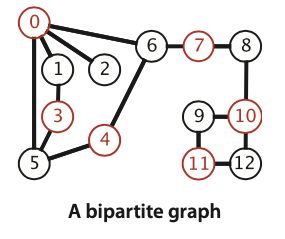

## Graph Algorithm Template

## Undirected Graph

### Is Graph Acyclic
- 是否能在无向图中找到cycle
- API  dfs(Graph G, int v, int u) vertex u 为 vertex v的上一个定点
```java
class Cycle{
	boolean[] visited;
	boolean hasCycle;
	public Cycle(Graph G){
		visited = new boolean[G.V()];
		for(int v = 0; v < G.V(); v++){
			if(!visited[v])
				dfs(G, v, v);
		}
	}
	// u -> v
	private void dfs(Graph G, int v, int u){
		visited[u] = true;
		for(int w : G.adj(v)){
			if(!visited[w])
				dfs(G, w, v);
			else if(w != u)
				hasCycle = true;
		}

	}
	private boolean hasCycle(){
		return hasCycle;
	}

}
```

### Is Graph bipartite?
- bipartite将Graph G中的vertices分成两组,每一组中的vertices相互之间没有edge
  


```java
class TwoColor{
	private boolean[] visited;
	private boolean[] color;
	private isBipartite = true;

	public TwoColor(Graph G){
		visited = new boolean[G.V()];
		color = new boolean[G.V()];
		for(int v = 0; v < G.V(); v++)
			if(!visited[v])
				dfs(G, v);
	}

	public boolean isBipartite(){
		return isBipartite;
	}

	private void dfs(Graph G, int vertex){
		visited[vertex] = true;
		for(int w : G.adj(vertex)){
			if(!visited[w]){
				color[w] = !color[vertex];
				dfs(G, w);
			}else if(color[vertex] == color[w]){
				isBipartite = false;
			}
		}
	}
}
```