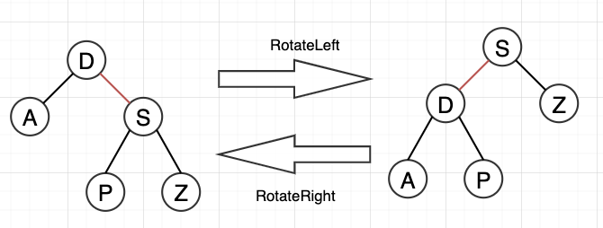

## Red Black Tree 
- rotateLeft(Node h)
- rotateRight(Node h)
- flipColor(Node h)
- put(Key key, Value val)
- the color of root node is always black
- 需要解决三种插入情况
  - 两个连续left red branch
  - h.left == RED && h.right == RED
  - h.left == RED && h.left.right == RED


```java
package searching;

public class RedBlackTree<Key extends Comparable<Key>, Value> {
  private static final boolean RED = true;
  private static final boolean BLACK = false;
  private Node root;

  class Node{
    Node left;
    Node right;
    Key key;
    Value val;
    Boolean color;

    public Node(Key key, Value val, Boolean color) {
      this.key = key;
      this.val = val;
      this.color = color;
    }
  }

  private boolean isRed(Node h) {
    if(h == null) return false;
    return h.color == RED;
  }

  private Node rotateLeft(Node h) {
    Node x = h.right;
    x.color = h.color;
    h.right = x.left;
    x.left = h;
    h.color = RED;
    return x;
  }

  private Node rotateRight(Node h) {
    Node x = h.left;
    x.color = h.color;
    h.left = x.right;
    x.right = h;
    h.color = RED;
    return x;
  }

  private void flipColor(Node h) {
    assert h.color!=RED;
    assert h.left.color == RED;
    assert h.right.color == RED;
    h.left.color = BLACK;
    h.right.color = BLACK;
    h.color = RED;
  }

  public void put(Key key, Value value) {
    Node root = put(this.root, key, value);
    root.color = BLACK; // the color of root node is always black
  }

  private Node put(Node h, Key key, Value val) {
    if(h == null) return new Node(h.key, h.val, RED);
    int comp = h.key.compareTo(key);
    if(comp < 0) h.right = put(h.right, key, val);
    else if(comp > 0) h.left = put(h.left, key, val);
    else h.val = val;

    if(isRed(h.right) && !isRed(h.left)) h = rotateLeft(h);
    if(isRed(h.left) && isRed(h.left.left)) h = rotateRight(h); //the second assessment would be executed if the first is false
    if(h.left.color == RED && h.right.color == RED) flipColor(h);

    return h;
  }
}
```
