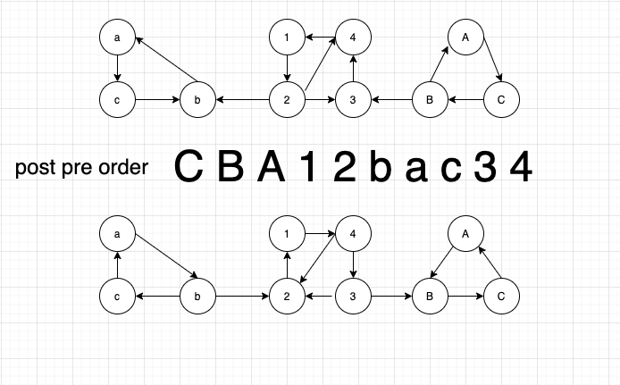

##Strongly Component Kosaraju Algorithm
- 在原graph 上做DFS，得到reverse post order的顺序
- 在reverse graph上用reverse post order去dfs原graph，就能求得strongly component
- (reverse graph 上做revese post order, 然后在原graph 上DFS也可以)
- DFS能够保证与当前vertex v strong connected 的component都被遍历到


```java
package graph.directedGraph;

import java.util.Arrays;
import java.util.Stack;

public class Kosaraju {
  private boolean[] marked;
  private int count;
  private int[] id;
  private Stack<Integer> reversePost = new Stack<>();

  public Kosaraju(Digraph digraph) {
    int V = digraph.V();
    marked = new boolean[V];
    id = new int[V];
    Digraph reverseGraph = reverse(digraph);
    for (int i = 0; i < V; i++) {
      if(!marked[i])
        reversePostOrder(reverseGraph, i);
    }
    //dfs with original graph; clear the marked array
    Arrays.fill(marked, false);
    while (!reversePost.isEmpty()) {
      int v = reversePost.pop();
      if(!marked[v]) {
        strongComponent(digraph, v);
        count++;
      }
    }
  }

  private void strongComponent(Digraph digraph, int vertex) {
    id[vertex] = count;
    marked[vertex] = true;
    for (Integer w : digraph.adj(vertex)) {
      if (!marked[w]) {
        strongComponent(digraph, w);
      }
    }
  }

  private Digraph reverse(Digraph digraph) {
    int V = digraph.V();
    Digraph reverseGraph = new Digraph(V);
    for (int v = 0; v < V; v++) {
      for (Integer w : digraph.adj(v)) {
        reverseGraph.addEdge(w, v);
      }
    }
    return reverseGraph;
  }

  private void reversePostOrder(Digraph digraph, int vertex) {
    marked[vertex] = true;
    for (Integer w : digraph.adj(vertex)) {
      if (!marked[w]) {
        reversePostOrder(digraph, w);
      }
    }
    reversePost.push(vertex);
  }

  public int count() { return count; }
  public int id(int vertex) { return id[vertex]; }
}
```